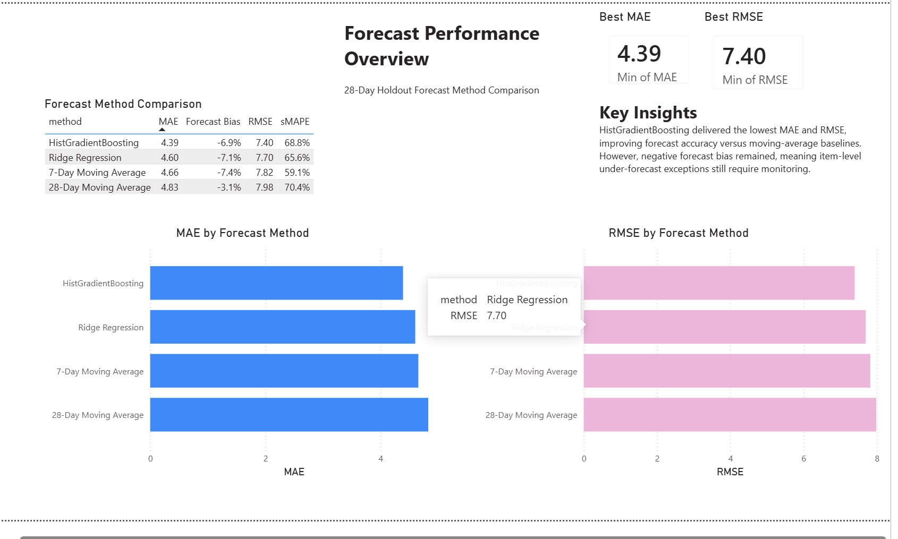
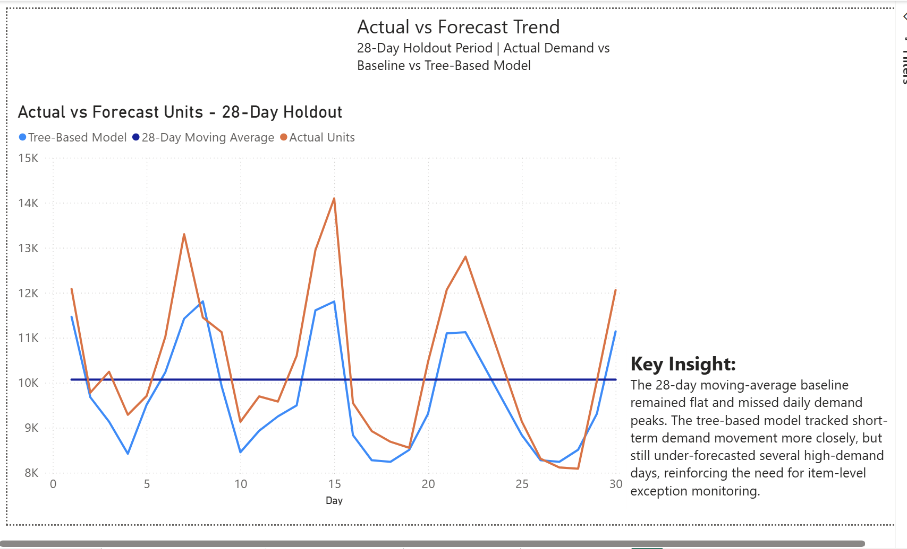
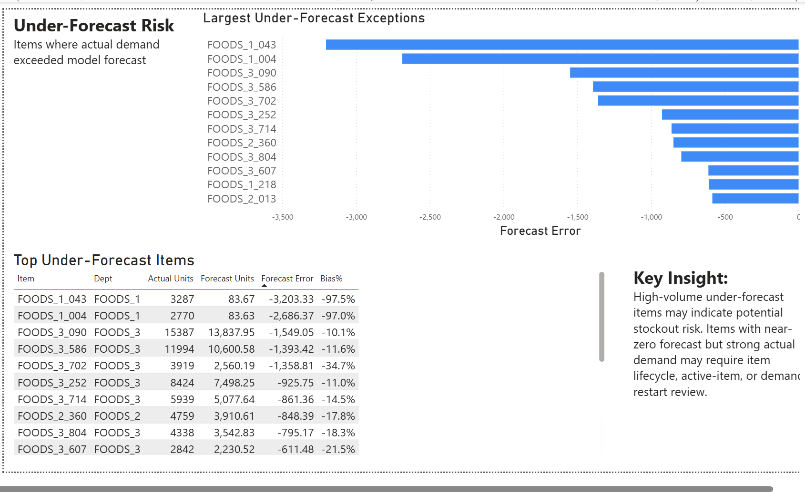
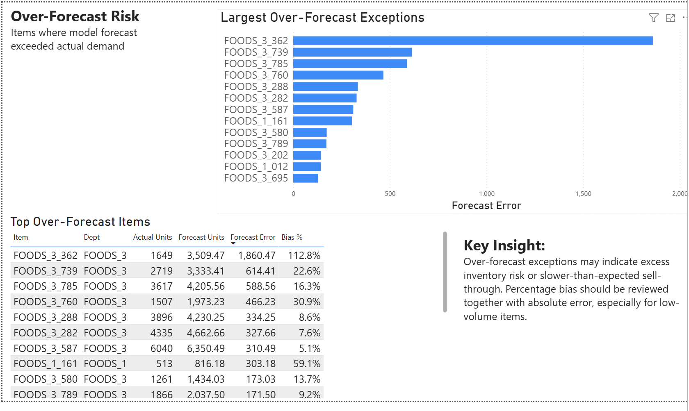

# Walmart Demand Forecasting & Inventory Risk Analysis

## Project Overview

This project analyzes Walmart food-category sales data to evaluate demand patterns, forecast accuracy, forecast bias, and item-level inventory risk.

The goal of the project is to simulate a retail forecasting workflow: identifying demand trends, comparing forecasting methods, and building Power BI dashboard views to support replenishment review, stockout monitoring, and excess inventory risk analysis.

## Business Questions

- Which forecasting method performs best on the 28-day holdout period?
- Does the best-performing model still show forecast bias?
- Which items are most at risk of under-forecasting and potential stockouts?
- Which items are most at risk of over-forecasting and potential excess inventory?
- How can forecast exception views support replenishment and inventory review?

## Data Source

The project uses the Walmart M5 Forecasting dataset from Kaggle.

The dataset includes sales, calendar, event, SNAP, and price information across Walmart stores and product categories.

Raw data files are not included in this repository. They can be downloaded from Kaggle.

## Methodology

### 1. Data Preparation

- Loaded sales, calendar, and price data.
- Filtered the analysis to the FOODS category.
- Selected the top 100 high-volume food items based on recent sales volume.
- Converted daily sales columns into a long-format dataset.
- Joined sales data with calendar, event, SNAP, and price features.
- Created additional features including revenue, weekend flag, event flag, and weekly sales trends.

### 2. Exploratory Analysis

- Analyzed daily and weekly sales trends.
- Reviewed item-level demand volatility.
- Compared sales patterns across departments and event periods.
- Identified high-volume and high-volatility items.

### 3. Forecasting

The final 28 days were used as a holdout period.

Forecasting methods compared:

- 7-day moving average baseline
- 28-day moving average baseline
- Ridge regression
- Tree-based model

### 4. Forecast Evaluation

Forecast methods were evaluated using:

- MAE
- RMSE
- Forecast Bias
- sMAPE

The tree-based model produced the lowest MAE and RMSE, improving MAE by 9.1% compared with the 28-day moving-average baseline.

However, the model still showed negative forecast bias, indicating that item-level under-forecast risk required further monitoring.

## Forecast Method Comparison

| Method | MAE | RMSE | Forecast Bias | sMAPE |
|---|---:|---:|---:|---:|
| Tree-Based Model | 4.39 | 7.40 | -6.88% | 68.83% |
| Ridge Regression | 4.60 | 7.70 | -7.11% | 65.60% |
| 7-Day Moving Average | 4.66 | 7.82 | -7.39% | 59.10% |
| 28-Day Moving Average | 4.83 | 7.98 | -3.06% | 70.37% |

## Dashboard Preview

### Forecast Performance Overview

### Actual vs Forecast Trend

### Under-Forecast Risk

### Over-Forecast Risk

## Key Findings

- The tree-based model delivered the lowest MAE and RMSE among the tested methods.
- MAE improved by 9.1% compared with the 28-day moving-average baseline.
- The 28-day moving-average baseline was stable but missed daily demand peaks and dips.
- The best-performing model still showed negative forecast bias, meaning under-forecast risk remained.
- Several high-volume items showed severe under-forecasting, indicating potential stockout risk.
- Over-forecast exceptions may indicate slower-than-expected sell-through or potential excess inventory risk.

## Business Recommendations

- Use moving-average baselines as transparent benchmarks before evaluating more advanced models.
- Monitor forecast bias in addition to accuracy metrics such as MAE and RMSE.
- Review high-volume under-forecast items for potential stockout risk.
- Review over-forecast exceptions for potential excess inventory or slower sell-through.
- Build recurring exception dashboards to support replenishment and inventory planning workflows.

## Tools Used

- Python
- pandas

- scikit-learn
- Power BI
- Excel
